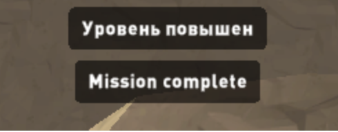

Вот отзыв от нашей команды:
- Отображайте информацию об элементах управления только в начале игры, а затем сделайте так, чтобы она исчезала. Также было бы неплохо, если бы вы добавили кнопку с информацией об элементах управления, чтобы игроки могли видеть информацию об элементах управления при нажатии на нее.

- Уберите эффект крови. (Это следует из инструкции PEGI-12)

- Удалите рекламный баннер из игрового процесса, поскольку он запрещен. Вы можете активировать рекламный баннер, когда игроки откроют "Меню вкладок", а затем убрать баннер, когда игроки вернутся к игровому процессу.

- Добавляйте в игру SDK для запуска/остановки игрового процесса. Запускайте игровой процесс, когда игроки активно играют в игру (запуск игры, возобновление из меню вкладок, возрождение, ...), и останавливайте игровой процесс, когда игроки не играют в игру (умирают, открывают меню вкладок,...)

- Пожалуйста, также укажите кнопку отключения звука в настройках

- В сцене завершения миссии есть русский текст, пожалуйста, измените его на английский: 

Как только вы внесете эти изменения, пожалуйста, загрузите файлы и перейдите в наш инструмент контроля качества, чтобы отправить их снова.